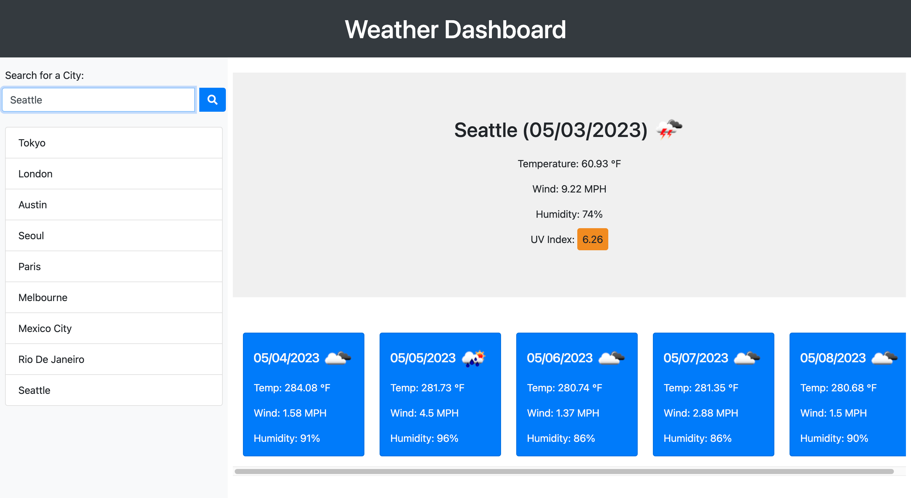

# Weather-Dashboard
Repository for UWCB week 6 challenge - Weather Dashboard

## Description
This is a Weather Dashboard app that utilizes the OpenWeather API to provide users with weather forecasts for any city they search for. The app provides current weather conditions as well as a five day forecast to allow users to plan their visits accordingly.

## Installation
To install this application clone the repository and open the main page in your browser.

## Usage
To use the app first search for a city. After searching for a city the page should populate with the current weather conditions of that city including temperature, wind speed, humidty and UV index. Below this will also be a forecast for the following five days. 

You may also notice upon searching for a city the page will add that searched city to a list below the search bar. This will serve as your search history and if you ever feel like revisiting a previous search click on that search in the list and your page will populate with weather information for that city.

The search history will disappear upon refreshing the page but the page should still be populated with information from you most recent search.

## Credit
Application created by Gene Kim

Email: [genedanielkim@gmail.com](mailto:genedanielkim@gmail.com)

## License
N/A